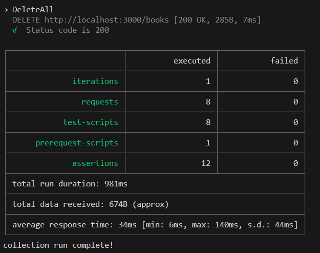

# NestJS Config and Prisma Book CRUD Example

## Introduction

Welcome to this NestJS project, which serves as a concise introduction to NestJS configuration and usage, with a focus on best practices. The primary goal of this project is to provide a clear example of a Book CRUD (Create, Read, Update, Delete) application while adhering to recommended NestJS practices.

## Features

### 1. Environment Variable Validation

I prioritize the robustness of my applications by including logic for validating environment variables. This ensures that your application is properly configured from the start.

### 2. Prisma + Postgres Integration

To enhance database operations, I have integrated [Prisma](https://www.prisma.io/) with a PostgreSQL database. This powerful combination simplifies database interactions and promotes efficient data management.

### 3. Custom Error Handling with Pipes

Experience a personalized approach to handling errors from bad requests through the use of custom pipes. This feature enables a more user-friendly and informative response when errors occur, contributing to a better user experience.

### 4. Postman Collection for Testing

To streamline the testing process, I provide a Postman collection that allows you to run tests effortlessly. Ensure you have [newman](https://www.npmjs.com/package/newman) and [@types/newman](https://www.npmjs.com/package/@types/newman) installed to leverage this feature.

## Getting Started

Follow these steps to set up and run the project:

1. Install dependencies:

   ```bash
   npm install
   ```

2. Configure environment variables:

   - Create a `.env` file with your db key : `DATABASE_URL=YOUR_DB_URL`
   - Populate the necessary variables with your values.

3. Run the application:

   ```bash
   npm run start
   ```

4. Explore and test:

   - Utilize the provided Postman collection for easy testing.
   - Ensure you have newman and @types/newman installed:

     ```bash
     npm install -g newman @types/newman
     ```

Output example for success (`Don't forget to run the docker container`):


Happy coding!
